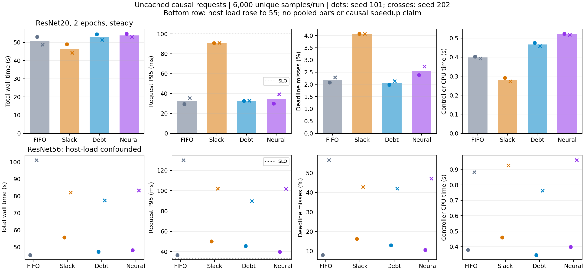
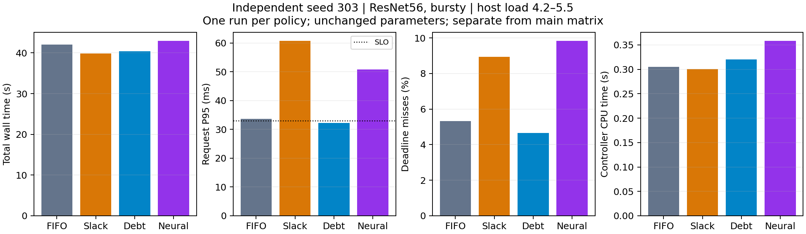

# 第三轮：扩大规模、因果请求调度与轻量学习消融

正式矩阵运行于 2026-09-22；补充诊断和新种子验证于 2026-09-24。此前成果保持在原分支历史中；这是新的在线请求验证轨道，不是对原论文全部实验的复现。

本轮实现了“训练服务欠账 + 等待势函数 + 经验耗时过滤”的控制器，以及 65 参数神经残差辅助。扩大评测后，**没有得到复杂策略稳定优于简单 FIFO 的证据，不建议将其替换为默认方案**。吞吐量、尾延迟和共享主机干扰必须同时报告。

## 扩大了什么

- ResNet20：从 1 epoch 扩到 2 epochs，完整 50,000 训练样本走两轮，共 1,580 次更新。
- ResNet56：855,770 参数，约为 ResNet20 的 272,474 参数的 3.14 倍；1 epoch、790 次更新。
- 每次主矩阵运行注入 6,000 个不重复测试样本，30 秒固定到达窗口，分别考察平稳/突发请求和 100/33 ms SLO。时延从预定到达计至结果同步完成。
- 禁用 GPU 输入缓存，处理所有逾期请求；相同设置、相同种子的请求轨迹和最终模型哈希必须相同。没有早退、删样本或减少训练更新。
- 主矩阵 2 设置 × 2 种子 × 4 策略 = 16 次运行。另有 4 次正确性 pilot、1 次区段计时诊断、4 次独立新种子对照，共 25 次 GPU 运行，阶段之间不混合计算平均加速。

只有 CIFAR10，一个共享主机、两种网络与有限运行；这是比此前严格的小规模可行性验证，仍不是跨数据集泛化、硬实时保证或显著性证明。两个压力设置同时改变多个因素，不是完整因子设计。

## 设计与近期参考

核心 idea 来自排队系统的积欠服务和控制工程的残差补偿：用欠账抵制训练长期得不到服务，用请求等待的二次势函数选择动作，用显式经验过滤器约束允许的动作。网络只修正耗时预测，不修改训练模型、不读取未来请求，也无权越过过滤器。

参考了 [EdgeServing（2026，全文）](https://arxiv.org/abs/2605.05527) 的队列/时限建模、[AoI-oriented link scheduling（2025，出版方摘要）](https://doi.org/10.1109/TWC.2025.3572690) 的服务积累视角，以及[残差学习 MPC（2025，摘要/Highlights）](https://doi.org/10.1016/j.conengprac.2025.106587) 的控制结构。借鉴不等于实现这些论文，也不构成新颖性证明。

[DESIGN.md](DESIGN.md) 是正式结果前写下的方案；[METHOD.md](METHOD.md) 记录公式、网络训练、时钟口径和局限；[SUPPLEMENT.md](SUPPLEMENT.md) 记录追加验证的原因和固定设置。

## 训练量加倍：收益伴随延迟代价

以下为两个种子的各运行指标的算术均值，P95 列是“每次运行 P95 的均值”，不是拼接请求后的 P95。

| 策略 | 总耗时 s | P95 ms | 超时率 % | 控制耗时 s |
|---|---:|---:|---:|---:|
| FIFO | 50.84 | 32.44 | 2.18 | 0.398 |
| Slack | 46.56 | 90.74 | 4.07 | 0.282 |
| Debt | 52.84 | 32.55 | 2.06 | 0.467 |
| Neural | 53.82 | 34.55 | 2.56 | 0.521 |

Slack 通过等待攒批将平均总耗时减少约 8.4%，但 P95 上升约 2.8 倍，超时率由 2.18% 上升到 4.07%。Debt 的超时率只有微小改善，总耗时反而增加约 3.9%；Neural 总耗时增加约 5.9%，没有改善平均超时率。这里不能把增加复杂度称为成功优化。

最终准确率在 seed 101/202 分别为 38.23% / 37.17%，每个种子的四策略完全相同，包括最终权重与 BN 缓冲的哈希。在线请求准确率另有记录：请求遇到的模型训练进度会随调度变化，不能与最终准确率混为一谈。

## 更深网络与突发流量：保留受干扰的原始结果

| 策略 | 种子 | 总耗时 s | P95 ms | 超时率 % | 主机负载起→止 |
|---|---:|---:|---:|---:|---:|
| debt | 101 | 47.18 | 45.52 | 12.90 | 5.55→4.42 |
| neural | 101 | 48.17 | 39.80 | 10.58 | 4.42→6.26 |
| fifo | 101 | 45.41 | 36.71 | 8.02 | 6.26→9.80 |
| slack | 101 | 55.74 | 50.10 | 16.28 | 9.80→25.32 |
| neural | 202 | 83.22 | 102.03 | 47.07 | 25.32→51.41 |
| fifo | 202 | 101.17 | 130.36 | 56.67 | 51.41→54.93 |
| slack | 202 | 82.13 | 102.06 | 42.83 | 54.93→54.88 |
| debt | 202 | 77.50 | 89.77 | 41.97 | 54.88→48.65 |

seed 101 后段开始出现负载攀升，seed 202 期间负载达到约 55。Debt 在 seed 202 相对 FIFO 的表面加速为 1.305×，但 seed 101 为 0.963×，且共享主机没有隔离。这不是可以宣称的稳定加速；也不能用两个种子的均值消除环境干扰。原始数据全部保留，图中这一组只显示各种子点，不画合并均值柱。



## 独立新种子复核

seed 303，所有参数保持不变，四次运行的主机负载为 4.20–5.55。以下结果独立展示，不与主矩阵合并：

| 策略 | 总耗时 s | P95 ms | P99 ms | 超时率 % | 控制耗时 s |
|---|---:|---:|---:|---:|---:|
| fifo | 42.05 | 33.63 | 143.12 | 5.33 | 0.305 |
| slack | 39.82 | 60.72 | 200.11 | 8.93 | 0.300 |
| debt | 40.41 | 32.29 | 73.00 | 4.65 | 0.320 |
| neural | 42.95 | 50.77 | 245.52 | 9.83 | 0.358 |

Debt 相对 FIFO 总耗时减少约 3.9%，P95 从 33.63 降到 32.29 ms，超时率从 5.33% 降到 4.65%。这是一个小幅正向样本，但与主矩阵中其他设置的结果不一致，不能据此声称稳定获益或算法普遍优越。

Neural 相对 Debt 耗时更长，P95 和超时率也更差；其控制耗时只有约 0.358 秒（总耗时的约 0.83%），说明“足够轻量”并不意味着调度有效。本轮不推荐启用神经变体作为默认。四策略最终准确率均为 16.69%，权重哈希完全一致。



## 边界诊断与下一步值得验证的 idea

平稳流量的全部主矩阵超时请求都在 epoch 边界进度被服务。单独区段计时的 FIFO 运行保持同一请求轨迹和最终模型哈希。19 次后续 epoch 启动中：

- epoch 开始回调到首个训练迭代回调：累计 2,375.7 ms，中位数 148.4 ms，最大 223.8 ms。
- 上次训练更新结束到首个迭代回调：累计 2,759.9 ms，最大 359.1 ms。
- 前一区段占后一区段累计时间约 86.1%。区段内包括数据迭代器启动、首批准备及其他回调，尚未细分每个函数，不能直接断言全部来自 DataLoader。

这表明“允许在哪里调度”比在现有边界上换一个更复杂的公式更值得优先验证。下一轮的具体假设是借鉴**带服务休假的排队系统**：把 epoch/experience 准备视作暂时停止推理服务的区段，使用分段准备或受控预取，让推理能在主机准备过程中获得服务机会；再由轻量控制器决定服务时机。这一改造尚未实现，必须继续验证 RNG、Replay 顺序、BN 状态与最终权重等价性，不能提前宣称有收益。

本轮 65 参数网络只是有界在线耗时残差，不是持续学习模型。开销较小不代表收益为正；现有结果不支持继续单纯增加网络容量。也没有把经验过滤器描述成硬实时安全保证。

## 留档与复现

- [主矩阵 CSV](main/results.csv)、[新种子 CSV](holdout/results.csv)、[pilot 说明](pilot/README.md)、[诊断 CSV](diagnostic/results.csv)。每个运行的目录均含逐请求记录、完整到达轨迹和指标，旁边保留原始日志与实际命令。
- [环境信息](environment.json)：物理 GPU 1（RTX 5090），CPU 库线程数 1；每行结果记录开始/结束主机负载。代码实现冻结于 `3446828`；补充阶段只添加运行与计时包装器，没有修改控制律或参数。
- [分析脚本](analyze.py) 从全部请求重算超时率、P95、goodput 并检查工作量/模型哈希；[补充分析](analyze_supplement.py) 单独核查追加结果。
- 所有原始请求都完整处理，未删除失败或不利结果。pilot 中发现的 goodput 分母问题保留原始记录并在其 README 中说明；正式矩阵前已修正。

在已经配置本项目 Avalanche fork 与 modified overlays 的环境中运行；本机解释器为 `/home/zhuzetong/.conda/envs/aocl/bin/python`：

```bash
python -m unittest discover -s tests -v
python optimization_logs/round3/run_matrix.py --phase main --output /tmp/rtcl-round3-main-new
python optimization_logs/round3/run_matrix.py --phase holdout --output /tmp/rtcl-round3-holdout-new
python optimization_logs/round3/run_matrix.py --phase diagnostic --output /tmp/rtcl-round3-diagnostic-new
python optimization_logs/round3/analyze.py
python optimization_logs/round3/analyze_supplement.py
```

运行器拒绝覆盖已有 `results.csv`；上述分析脚本默认分析本目录留档，而不是 `/tmp` 的重跑输出。19 项单元测试、25 次真实 GPU 运行和逐请求审计分别承担控制逻辑、集成路径和数据完整性的验证。
